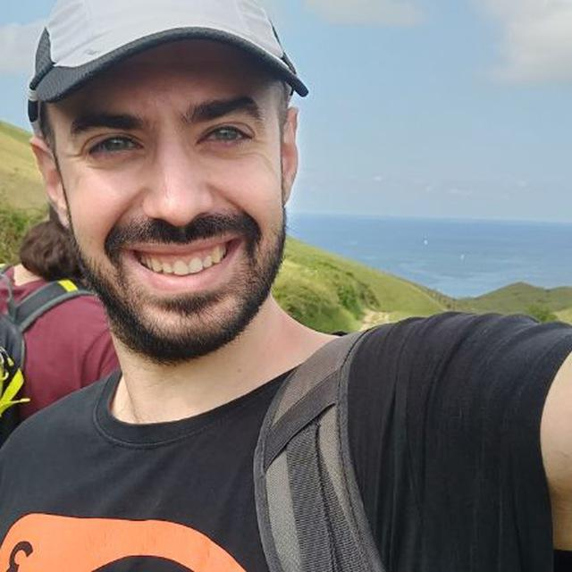

Francisco Javier Moragón Fernández
==================================

# About me

## Description
  
I am Javier Moragón, a software developer with more than 4 years of professional experience that have worked mostly for mobile telecommunications systems.
  
During my career I used a lot of programming languages such as Java, C#, JavaScript,  PHP... but I am more proficient with Python, C and C++.
  
I am passionate about software development, videogames and pizza.  In the projects section you can see some stuff I have been working on.

## Contact
  
[linkedin]({'name': 'Javier Moragón', 'url': 'https://www.linkedin.com/in/francisco-javier-morag%C3%B3n-fern%C3%A1ndez-5759b8bb/'})  
[github]({'name': 'Jamofer', 'url': 'https://github.com/jamofer'})  
[email]({'name': 'jamofer@gmail.com', 'url': 'mailto:jamofer@gmail.com'})  
[phone]({'name': '+34 000 00 00 00', 'url': 'tel:+34000000000'})
# Studies
  
Degree in Telematics Engineering
# Career
  
MAHLE  
Casa Systems  
Sistelbanda  
Sistelbanda  
CEAM
# Projects
  
Flask Desktop UI  
Telegram Decabot  
Capture The Pixel  
Spookie Boogie  
Valencia Bici  
Buggy Jumper
